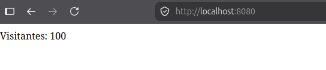

# DIAS DIEZ

Hoy a parte de que se nos explique un poco acerca de `Plantillas` haremos un pequeño ejercicio que se llama contador de visitas.

El codigo que tengo es el siguiente es algo sencillo que se me ocurrio:

```java
package ruvik.contadorvisita;

import org.springframework.web.bind.annotation.GetMapping;
import org.springframework.web.bind.annotation.RestController;

@RestController
public class ControllerContadorVisitas {
    private int cotador;
    @GetMapping("/")
    public String contadorVisitas() {
        cotador++;

        return "Visitantes: " + cotador;
    }
}
```
eso devuelve un resultado como el siguiente:




## Nuevos conceptos

**Threads vs event loap**

Threads Safe y es que el hecho de hacer muchos hilos se pueden pizar, pero con forma de bloquearlo podemos.

```java
package ruvik.contadorvisita;

import org.springframework.web.bind.annotation.GetMapping;
import org.springframework.web.bind.annotation.RestController;

import java.util.concurrent.atomic.AtomicInteger;

@RestController
public class ControllerContadorVisitas {
    private AtomicInteger cotador = new AtomicInteger(0);
    @GetMapping("/")
    public String contadorVisitas() {

        return "Visitantes: " + cotador.getAndAdd(1);
    }
}

```

Atomic es indivisible, hace una perteción a la vez

 ## @Controller

`@RequestMapping`

con `String` busca la carpeta Templeates/ejemplo.html

diferencias de Static es que es procesado, va alimentar datos a la plantilla

## Plantillas

Se deben tener una dependecias utilizar las una dependecia.

**thymeleaf**

```java
plugins {
    id 'java'
    id 'org.springframework.boot' version '4.1.1'
    id 'io.spring.dependency-management' version '1.1.7'
}

group = 'Ruvik'
version = '0.0.1-SNAPSHOT'
description = 'HolaMundoConPlantilla'

java {
    toolchain {
        languageVersion = JavaLanguageVersion.of(21)
    }
}

repositories {
    mavenCentral()
}

dependencies {
    implementation 'org.springframework.boot:spring-boot-starter-thymeleaf'
    implementation 'org.springframework.boot:spring-boot-starter-webmvc'
    developmentOnly 'org.springframework.boot:spring-boot-devtools'
    testImplementation 'org.springframework.boot:spring-boot-starter-thymeleaf-test'
    testImplementation 'org.springframework.boot:spring-boot-starter-webmvc-test'
    testRuntimeOnly 'org.junit.platform:junit-platform-launcher'
}

tasks.named('test') {
    useJUnitPlatform()
}

```

**IMPORTANTE:** `@Controller`

ahora tenemos nuevas forma de viasulizar e introducir texto, tenemos plantilla en template y ahora mismo tenemos algo nuevo. Un objeto `Model`

```java
package ruvik.holamundoconplantilla;

import org.springframework.stereotype.Controller;
import org.springframework.ui.Model;
import org.springframework.web.bind.annotation.GetMapping;
import org.springframework.web.bind.annotation.RequestParam;
import org.springframework.web.bind.annotation.RestController;

@Controller
public class ControllerPlantilla {
    @GetMapping("/saludo")
    public String index(@RequestParam(name = "nombre",defaultValue = "mundo cruel")String nombre, Model modelo) {
        modelo.addAttribute("mensaje",nombre);
        return "hola.html";
    }
}
```
En html podemos incluir cosas importante que son ahora mismo nuevas cosas de la plantilla Thymeleaf 

```html
<html>
    <h1 th:text="|Hola ${mensaje}|" ></h1>
</html>
```

el `th:text="${mensaje}` esto captura el mensaje importante, para contetar mejor variables y con texto es mejor `<h1 th:text="|Hola ${mensaje}|" ></h1>` utilizando `|` para hacer un trabajao mejor.

Algunas de las etiquestas importantes es 
`th:if` boolean

`th:eless`

`th:else`

`th:each` loop

**TODO LO VISTO CONVERGE AHÍ:** [[D1 -UD2]]