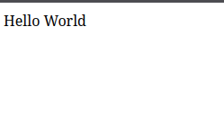

<div class="cover">
<h1>Bitácora de desarrollo</h1>
<p>SPRING BOOT · PRIMEROS ENDPOINTS Y FORMULARIOS</p>
<p class="serial">DÍA 7 // GUÍA DE CAMPO · DESARROLLO WEB</p>
</div>

## Objetivo de la sesión

> En esta sesión hice una primera prueba con Spring Boot, creé un endpoint `GET` para saludar y trabajé el envío de un formulario mediante `POST`.

El proyecto se puede crear con Gradle o Maven. En esta práctica utilicé Maven y añadí, por el momento, la dependencia **Spring Web**. También es posible seguir los mismos pasos desde IntelliJ IDEA o desde otro entorno de programación.

## Primer arranque

Al ejecutar la aplicación, Spring Boot inicia el servidor integrado. Con el proyecto en marcha, añadí un endpoint para responder a las peticiones `GET` en `/hello`:

```JAVA
package com.example.demo;

import org.springframework.boot.SpringApplication;
import org.springframework.boot.autoconfigure.SpringBootApplication;
import org.springframework.web.bind.annotation.GetMapping;
import org.springframework.web.bind.annotation.RequestParam;
import org.springframework.web.bind.annotation.RestController;

@SpringBootApplication
@RestController
public class DemoApplication {

    public static void main(String[] args) {
        SpringApplication.run(DemoApplication.class, args);
    }

    @GetMapping("/hello")
    public String hello(
            @RequestParam(value = "name", defaultValue = "World") String name) {
        return String.format("Hello %s", name);
    }
}
```

Al visitar `/hello`, el parámetro `name` no está presente, así que se utiliza el valor predeterminado `World`.

**Petición a `/hello`:**


**Respuesta:**



Si añado `?name=ruvik` a la URL, Spring recibe ese valor y lo incluye en el saludo.

**Petición a `/hello?name=ruvik`:**


**Respuesta:**


## GET y POST con un formulario

Al principio confundí las funciones de `GET` y `POST`. Se suelen usar en el mismo flujo, pero cumplen tareas distintas: `GET` solicita o muestra el formulario y `POST` envía sus datos para que el servidor los procese.

El primer intento falló porque la ruta de `action` del formulario no coincidía con la ruta de `@PostMapping`. El navegador envía la petición a la dirección indicada en `action`, por lo que ambas rutas deben coincidir.

> La ruta de `action` debe coincidir con la ruta de `@PostMapping`. Además, el atributo `name` de cada campo debe coincidir con el nombre que se espera en `@RequestParam`.

## Formulario y procesamiento

Para servir un HTML estático con Spring Web, guarda el archivo en `src/main/resources/static/formulario.html` y ábrelo en `/formulario.html`. No hace falta crear un `@GetMapping` que devuelva la ruta del archivo: con `@RestController`, una cadena devuelta por un método se envía como texto en la respuesta, no se interpreta como una página HTML.

El formulario envía el campo `nombre` mediante `POST` a `/formulario`:

```html
<!DOCTYPE html>
<html lang="es">
<body>
    <form method="POST" action="/formulario">
        <label for="nombre">Nombre:</label>
        <input type="text" name="nombre" id="nombre">
        <button type="submit">Enviar</button>
    </form>
</body>
</html>
```

El controlador recibe el valor de `name="nombre"` con `@RequestParam` y devuelve un saludo:

```java
@PostMapping("/formulario")
public String procesarDatos(@RequestParam("nombre") String nombre) {
    if (!nombre.isBlank()) {
        return String.format("Hola %s", nombre);
    }
    return "Hola mundo";
}
```

Así queda conectado el recorrido: el navegador envía `nombre`, Spring lo asocia con el parámetro del método y el endpoint responde con el resultado.